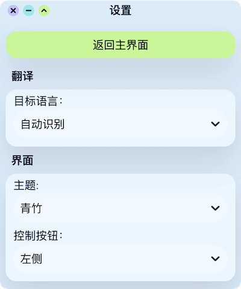
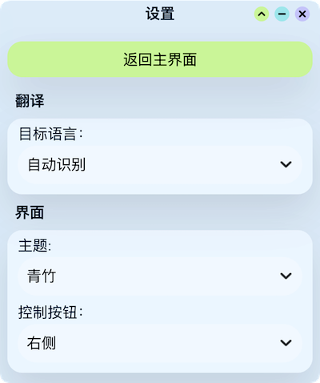

<!--
 * @Author: KrisLee 2030000020@qq.com
 * @Date: 2022-09-22 15:53:48
 * @LastEditors: KrisLee 2030000020@qq.com
 * @LastEditTime: 2022-09-25 14:14:40
 * @FilePath: /panda-dict/README.md
 * @Description: 这是默认设置,请设置`customMade`, 打开koroFileHeader查看配置 进行设置: https://github.com/OBKoro1/koro1FileHeader/wiki/%E9%85%8D%E7%BD%AE
-->

# PandaDict 胖哒词典

**一款快捷桌面词典。支持文本翻译、截图翻译、查词、OCR识别，支持上百种语言。**

### 目录
   - [主题预览](#主题预览)
   - [API 注册](#api-注册)
   - [界面设置](#界面设置)
   - [快捷键设置](#快捷键设置)

### 主题预览
 #### 浅色
    
 #### 暗夜
   

### API 注册
1. 点击前往[有道智云](https://ai.youdao.com/)
2. 注册登陆账号
3. 控制台 > 业务指南 > 应用总览 > 选择 **文本翻译** 和 **通用文字识别** 服务 > API接入方式
   
4. 控制台 > 业务指南 > 业务总览：复制对应 **应用ID** 和 **应用密钥** 到胖哒词典API设置中
   

### 界面设置
- 多种主题选择，自适应深色模式
- 控制按钮位置自定义
  
     

### 快捷键设置
1. 按删除键 <kbd>Backspace</kbd> ( <kbd>←</kbd> ) 删除已设置的快捷键
2. 再按下自定义的快捷按键
    >提示：快捷按键由 *至少1个* **功能键** (<kbd>Shift</kbd>、<kbd>Ctrl</kbd>、<kbd>Alt</kbd>、<kbd>⌥ Option</kbd>、<kbd>⌘ Cmd</kbd>、<kbd>⊞ Win</kbd>) + *1个* **普通键** (字母、数字、符号等按键) 组成
    
   